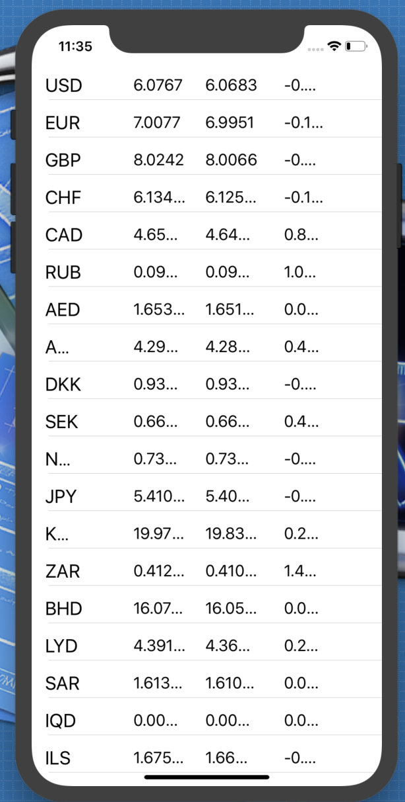

# iOS Projects

## Projenin Amacı

Swift-5 ile ilgili en temel konuları bir önceki projede anlatmaya devam ediyorum. Öğrendiklerimizi pekiştirmek ve birbirinden farklı projeler geliştirmek için oluşturulmuş bir projedir.

## Projenin İçeriği
Swift-5 ile geliştirilmiş olan birbirinden farklı seviyede uygulamaları içeren bir projedir.  

## Uygulamalar 

- [Images](https://github.com/halilozel1903/iOSProjects/tree/master/Images)
- [Segues](https://github.com/halilozel1903/iOSProjects/tree/master/Segues)
- [Timers](https://github.com/halilozel1903/iOSProjects/tree/master/Timers)
- [Gesture Recognizer](https://github.com/halilozel1903/iOSProjects/tree/master/GestureRecogziner)
- [Colors](https://github.com/halilozel1903/iOSProjects/tree/master/Colors)
- [Launch Screen](https://github.com/halilozel1903/iOSProjects/tree/master/LaunchScreen)
- [Alert](https://github.com/halilozel1903/iOSProjects/tree/master/AlertProject)
- [Table View](https://github.com/halilozel1903/iOSProjects/tree/master/TableViewExample)
- [Core Data](https://github.com/halilozel1903/iOSProjects/tree/master/CoreDataExample)
- [MapView](https://github.com/halilozel1903/iOSProjects/tree/master/MapView)
- [TouchID](https://github.com/halilozel1903/iOSProjects/tree/master/TouchID)
- [Tab Bars](https://github.com/halilozel1903/iOSProjects/tree/master/TabExample)
- [IntelligentImage](https://github.com/halilozel1903/iOSProjects/tree/master/IntelligentImage)
- [Navigation Bar](https://github.com/halilozel1903/iOSProjects/tree/master/NavigationBar)
- [Toolbar](https://github.com/halilozel1903/iOSProjects/tree/master/Toolbar)
- [Kronometre](https://github.com/halilozel1903/iOSProjects/tree/master/KronometreApp)
- [Klavyeyi Kontrol Etme](https://github.com/halilozel1903/iOSProjects/tree/master/KlavyeyiKontrolEtme)
- [ViewController](https://github.com/halilozel1903/iOSProjects/tree/master/ViewControllerApp)
- [Table View Example](https://github.com/halilozel1903/iOSProjects/tree/master/TableApp)
- [Table View Search](https://github.com/halilozel1903/iOSProjects/tree/master/TableViewSearch)
- [Collection View](https://github.com/halilozel1903/iOSProjects/tree/master/CollectionViewApp)
- [UIViewControllerLifecycle](https://github.com/halilozel1903/iOSProjects/tree/master/UIViewControllerLifecycle)
- [TabBarApp](https://github.com/halilozel1903/iOSProjects/tree/master/TabBarApp)
- [SwitchScreens](https://github.com/halilozel1903/iOSProjects/tree/master/SwitchScreens)
- [Delegate](https://github.com/halilozel1903/iOSProjects/tree/master/DelegateDataSaved)
- [NotificationCenter](https://github.com/halilozel1903/iOSProjects/tree/master/NotificationCenter)
- [FindMyAge](https://github.com/halilozel1903/iOSProjects/tree/master/FindMyAge)
- [Calculator](https://github.com/halilozel1903/iOSProjects/tree/master/Calculator)
- [Animations](https://github.com/halilozel1903/iOSProjects/tree/master/Animations)
- [Swipe And Shake App](https://github.com/halilozel1903/iOSProjects/tree/master/SwipeAndShakeApp)
- [Swipe Gesture Recognizer](https://github.com/halilozel1903/iOSProjects/tree/master/SwipeGestureRecognizer)
- [Alert View](https://github.com/halilozel1903/iOSProjects/tree/master/AlertViewApp)
- [Picker View](https://github.com/halilozel1903/iOSProjects/tree/master/PickerViewApp)
- [Date Picker](https://github.com/halilozel1903/iOSProjects/tree/master/DatePickerViewApp)
- [Web View](https://github.com/halilozel1903/iOSProjects/tree/master/WebViewApp)
- [MVC App](https://github.com/halilozel1903/iOSProjects/tree/master/MVCApp)
- [MVVM App](https://github.com/halilozel1903/iOSProjects/tree/master/MVVMApp)
- [Cocoa Pods App](https://github.com/halilozel1903/iOSProjects/tree/master/CocoaPodsApp)
- [Audio Speech Recognition](https://github.com/halilozel1903/iOSProjects/tree/master/AudioSpeechRecognition)
- [Speech Recognition](https://github.com/halilozel1903/iOSProjects/tree/master/SpeechRecognition)
- [Speech App](https://github.com/halilozel1903/iOSProjects/tree/master/SpeechApp)
- [SiriKit](https://github.com/halilozel1903/iOSProjects/tree/master/MessageApp)
- [Quick Action](https://github.com/halilozel1903/iOSProjects/tree/master/QuickActionApp)
- [Custom Keyboard](https://github.com/halilozel1903/iOSProjects/tree/master/CustomKeyboardApp)
- [Prime Number App](https://github.com/halilozel1903/iOSProjects/tree/master/FindPrimeNumber)
- [Navigation Menu App](https://github.com/halilozel1903/iOSProjects/tree/master/NavigationMenuApp)
- [Bomb Timer App](https://github.com/halilozel1903/iOSProjects/tree/master/BombTimer)
- [Music App](https://github.com/halilozel1903/iOSProjects/tree/master/Xylophone-iOS11-master)
- [Language App](https://github.com/halilozel1903/iOSProjects/tree/master/LanguageApp)
- [Times Table App](https://github.com/halilozel1903/iOSProjects/tree/master/TimesTableApp)
- [UserDefaults App](https://github.com/halilozel1903/iOSProjects/tree/master/UserDefaultsApp)
- [Multiple View Controllers](https://github.com/halilozel1903/iOSProjects/tree/master/MultipleViewControllers)
- [Controlling The Keyboard](https://github.com/halilozel1903/iOSProjects/tree/master/ControllingTheKeyboard)
- [Auto Layout Programmatic](https://github.com/halilozel1903/iOSProjects/tree/master/AutoLayoutProgrammatic)

 

## Uygulama İçerikleri

- [To Do List](https://github.com/halilozel1903/iOSProjects/tree/master/ToDoList) : To Do List uygulamasında TabView, TableView,Label,Text Field ve Button kullanılmıştır. Tab sayesinde sayfalar arası geçiş yapılabilmektedir. Kullanıcı 2.sayfada ekleme yapıp add butonuna tıklayınca UserDefaults içine kayıt edilip ilk ekranda onu TableView yardımıyla listelemektedir. Her eklenen veri için tablo güncellenmektedir. Listede istemediğimiz bir şey varsa sağdan sola hücreyi çekerek o bileşeni silebiliriz. Silinen elemanla birlikte table tekrardan güncellenir.

    
    

   

- [Currency App](https://github.com/halilozel1903/iOSProjects/tree/master/JsonApiApp) : Currency uygulaması anlık olarak para birimleri ile bilgileri alıp kullanıcıya gösterilen basic düzeyde bir uygulamadır. Kullanıcı para birim ile ilgili kodu,alış-satış değerlerini ve ismini görebilmektedir. Uygulamada JSON veri kullanıldığı için [SwiftyJSON](https://github.com/SwiftyJSON/SwiftyJSON) kütüphanesi kullanılmaktadır. Ekstra HTTP istekleri ile ilgili işlemleri yürütebilmek için [Alamofire](https://github.com/Alamofire/Alamofire) kütüphanesi kullanılmaktadır. API olarak [Döviz API](https://www.doviz.com/api/v1/currencies/all/latest) kullanılmaktadır.

   

   

- [Downloading Web Content](https://github.com/halilozel1903/iOSProjects/tree/master/DownloadingWebContent) : Downloading Web Content uygulaması Webten bir adrese girip sayfanın kaynak kodlarını çekme işlemini yapmaktadır. Uygulamada http ya da https kısmına bakmaksızın direkt tanımlanan adrese gidilip, adresin kaynak dosyaları Consol ekranında görüntülenir.

   

- [Web Kit App](https://github.com/halilozel1903/iOSProjects/tree/master/WebViewExample) : Web Kit kullanarak url bilgisi girildiği takdirde http ya da https uzantılı olmaksızın istenilen siteye girilmektedir. Site içerisinde ileriye veya geriye git işlemlerini 2 adet buton yardımıyla yapabilirsiniz. Gittiğiniz url adresi üstte bulunan TextField alanında güncellenmektedir. Http ile giriş yapabilmek için Plist kısmında ufak bir ayarlama yapmalısınız.Bunların hepsini projede ayrıntılı bir şekilde bulabilirsiniz.

  

   

- [Auto Layout](https://github.com/halilozel1903/iOSProjects/tree/master/AutoLayout) : Auto Layout dizaynını görsel ekrandan farklı olarak kod kısmında gerekli kodlar yazarak oluşturulan bir projedir. Örnekte bir adet resim ve bir adet label eklendi. Eklenen label'a birçok özellik eklendi. Birbirlerine olan konumları ve özellikleri tanımlandı. Aşağıdaki resmi inceleyebilirsiniz : 

   

- [Auto Layout Example](https://github.com/halilozel1903/iOSProjects/tree/master/AutoLayout) : Auto Layout yapısı iOS programlamada en önemli yapılardan birisidir. 4 özelliği doğru bir şekilde kullanarak uygulamalarınızda harika tasarımlar yapabilirsiniz. Bu özellikler : x,y eksenleri ve width - height özellikleridir. Örnekte resim,label ve buton yapıları kullanılmıştır. Aşağıdaki resmi inceleyebilirsiniz : 

   

# NOT
Örnek proje ve uygulamalar eklenmeye devam edecektir.  
