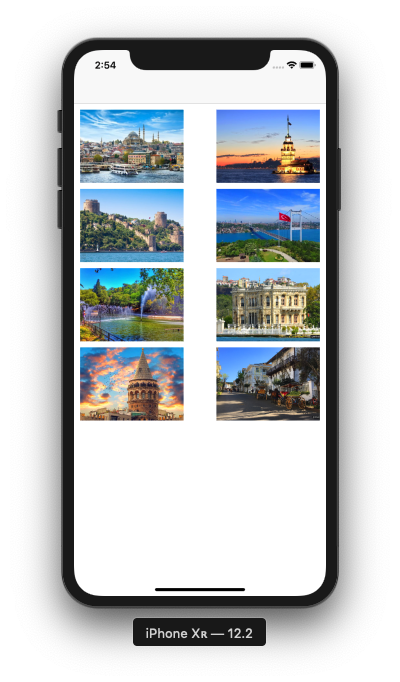
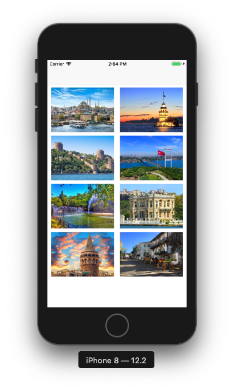
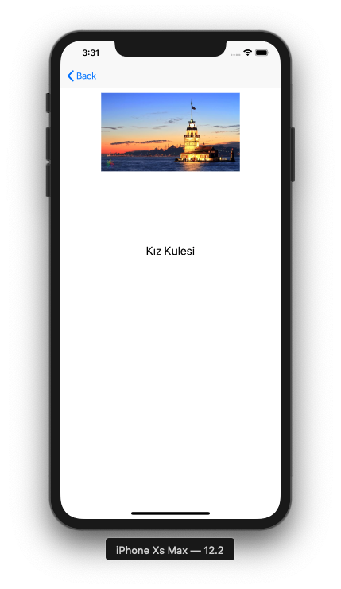

# iOS Projects


## The goal of the project

I continue to explain the basic issues about Swift-5 in the previous project. It is a project created to reinforce what we learned and to develop different projects.


## Content of the Project
Swift-5 ile geliştirilmiş olan birbirinden farklı seviyede uygulamaları içeren bir projedir. <br>


## Apps 

- [Images](https://github.com/halilozel1903/iOSProjects/tree/master/Images)
- [Segues](https://github.com/halilozel1903/iOSProjects/tree/master/Segues)
- [Timers](https://github.com/halilozel1903/iOSProjects/tree/master/Timers)
- [Gesture Recognizer](https://github.com/halilozel1903/iOSProjects/tree/master/GestureRecogziner)
- [Colors](https://github.com/halilozel1903/iOSProjects/tree/master/Colors)
- [Launch Screen](https://github.com/halilozel1903/iOSProjects/tree/master/LaunchScreen)
- [Alert](https://github.com/halilozel1903/iOSProjects/tree/master/AlertProject)
- [Table View](https://github.com/halilozel1903/iOSProjects/tree/master/TableViewExample)
- [Core Data](https://github.com/halilozel1903/iOSProjects/tree/master/CoreDataExample)
- [MapView](https://github.com/halilozel1903/iOSProjects/tree/master/MapView)
- [TouchID](https://github.com/halilozel1903/iOSProjects/tree/master/TouchID)
- [Tab Bars](https://github.com/halilozel1903/iOSProjects/tree/master/TabExample)
- [IntelligentImage](https://github.com/halilozel1903/iOSProjects/tree/master/IntelligentImage)
- [Navigation Bar](https://github.com/halilozel1903/iOSProjects/tree/master/NavigationBar)
- [Toolbar](https://github.com/halilozel1903/iOSProjects/tree/master/Toolbar)
- [Kronometre](https://github.com/halilozel1903/iOSProjects/tree/master/KronometreApp)
- [Klavyeyi Kontrol Etme](https://github.com/halilozel1903/iOSProjects/tree/master/KlavyeyiKontrolEtme)
- [ViewController](https://github.com/halilozel1903/iOSProjects/tree/master/ViewControllerApp)
- [Table View Example](https://github.com/halilozel1903/iOSProjects/tree/master/TableApp)
- [Table View Search](https://github.com/halilozel1903/iOSProjects/tree/master/TableViewSearch)
- [Collection View](https://github.com/halilozel1903/iOSProjects/tree/master/CollectionViewApp)
- [UIViewControllerLifecycle](https://github.com/halilozel1903/iOSProjects/tree/master/UIViewControllerLifecycle)
- [TabBarApp](https://github.com/halilozel1903/iOSProjects/tree/master/TabBarApp)
- [SwitchScreens](https://github.com/halilozel1903/iOSProjects/tree/master/SwitchScreens)
- [Delegate](https://github.com/halilozel1903/iOSProjects/tree/master/DelegateDataSaved)
- [NotificationCenter](https://github.com/halilozel1903/iOSProjects/tree/master/NotificationCenter)
- [FindMyAge](https://github.com/halilozel1903/iOSProjects/tree/master/FindMyAge)
- [Calculator](https://github.com/halilozel1903/iOSProjects/tree/master/Calculator)
- [Animations](https://github.com/halilozel1903/iOSProjects/tree/master/Animations)
- [Swipe And Shake App](https://github.com/halilozel1903/iOSProjects/tree/master/SwipeAndShakeApp)
- [Swipe Gesture Recognizer](https://github.com/halilozel1903/iOSProjects/tree/master/SwipeGestureRecognizer)
- [Alert View](https://github.com/halilozel1903/iOSProjects/tree/master/AlertViewApp)
- [Picker View](https://github.com/halilozel1903/iOSProjects/tree/master/PickerViewApp)
- [Date Picker](https://github.com/halilozel1903/iOSProjects/tree/master/DatePickerViewApp)
- [Web View](https://github.com/halilozel1903/iOSProjects/tree/master/WebViewApp)
- [MVC App](https://github.com/halilozel1903/iOSProjects/tree/master/MVCApp)
- [MVVM App](https://github.com/halilozel1903/iOSProjects/tree/master/MVVMApp)
- [Cocoa Pods App](https://github.com/halilozel1903/iOSProjects/tree/master/CocoaPodsApp)
- [Audio Speech Recognition](https://github.com/halilozel1903/iOSProjects/tree/master/AudioSpeechRecognition)
- [Speech Recognition](https://github.com/halilozel1903/iOSProjects/tree/master/SpeechRecognition)
- [Speech App](https://github.com/halilozel1903/iOSProjects/tree/master/SpeechApp)
- [SiriKit](https://github.com/halilozel1903/iOSProjects/tree/master/MessageApp)
- [Quick Action](https://github.com/halilozel1903/iOSProjects/tree/master/QuickActionApp)
- [Custom Keyboard](https://github.com/halilozel1903/iOSProjects/tree/master/CustomKeyboardApp)
- [Prime Number App](https://github.com/halilozel1903/iOSProjects/tree/master/FindPrimeNumber)
- [Navigation Menu App](https://github.com/halilozel1903/iOSProjects/tree/master/NavigationMenuApp)
- [Bomb Timer App](https://github.com/halilozel1903/iOSProjects/tree/master/BombTimer)
- [Music App](https://github.com/halilozel1903/iOSProjects/tree/master/Xylophone-iOS11-master)
- [Language App](https://github.com/halilozel1903/iOSProjects/tree/master/LanguageApp)
- [Times Table App](https://github.com/halilozel1903/iOSProjects/tree/master/TimesTableApp)
- [UserDefaults App](https://github.com/halilozel1903/iOSProjects/tree/master/UserDefaultsApp)
- [Multiple View Controllers](https://github.com/halilozel1903/iOSProjects/tree/master/MultipleViewControllers)
- [Controlling The Keyboard](https://github.com/halilozel1903/iOSProjects/tree/master/ControllingTheKeyboard)
- [Auto Layout Programmatic](https://github.com/halilozel1903/iOSProjects/tree/master/AutoLayoutProgrammatic)
- [CollectionViewApplication](https://github.com/halilozel1903/iOSProjects/tree/master/CollectionViewApplication)

<br>

## Application Contents

- [CollectionViewApplication](https://github.com/halilozel1903/iOSProjects/tree/master/CollectionViewApplication) : It is an application related to the use of Collection View. In the application, there are pictures of the famous places of Istanbul. When the pictures are clicked, the larger version of the picture and the name of that place appear in the detail section. The application was tried on iPhone XS Max, iPhone XR and iPhone 8 devices.

 <br>

   <br>
  <br>

<br> <br>

- [To Do List](https://github.com/halilozel1903/iOSProjects/tree/master/ToDoList) : TabView, TableView, Label, Text Field and Button are used in To Do List application. Thanks to the tab, you can switch between pages. When the user adds to the 2nd page and clicks the add button, he is registered in UserDefaults and lists it with the help of TableView on the first screen. The table is updated for each added data. If there is something we do not want in the list, we can delete that component by pulling the cell from right to left. The table is updated again with the deleted element.

   <br>
    

<br> <br>

- [Currency App](https://github.com/halilozel1903/iOSProjects/tree/master/JsonApiApp) : Currency application is a basic application that instantly takes information with currencies and is displayed to the user. The user can see the code, buy-sell values and name related to the currency. Since the application uses JSON data, [SwiftyJSON](https://github.com/SwiftyJSON/SwiftyJSON) library is used. To be able to execute transactions related to extra HTTP requests [Alamofire](https://github.com/Alamofire/Alamofire) library is used. As an API [Döviz API](https://www.doviz.com/api/v1/currencies/all/latest) used.

  <br>


<br> <br>

- [Downloading Web Content](https://github.com/halilozel1903/iOSProjects/tree/master/DownloadingWebContent) :Downloading Web Content application enters an address from the web and takes the source code of the page. Regardless of the http or https section in the application, the address that is directly defined is accessed and the source files of the address are displayed on the Consol screen.


<br> <br>

- [Web Kit App](https://github.com/halilozel1903/iOSProjects/tree/master/WebViewExample) :If url information is entered using Web Kit, it is entered to the desired site without http or https extension. You can go forward or back in the site with the help of 2 buttons. The url address you go to is updated in the TextField field at the top. In order to log in with http, you should make a small adjustment in Plist section. You can find all of these in detail in the project.

  

<br> <br>


- [Auto Layout](https://github.com/halilozel1903/iOSProjects/tree/master/AutoLayout) : Unlike the visual screen, the Auto Layout design is a project created by writing the necessary codes in the code section. In the example, a picture and a label were added. Many features have been added to the added label. Their locations and properties were defined. You can review the picture below:


<br> <br>


- [Auto Layout Example](https://github.com/halilozel1903/iOSProjects/tree/master/AutoLayout) : The Auto Layout structure is one of the most important structures in iOS programming. You can make great designs in your applications by using 4 features correctly. These properties are: x, y axes and width - height properties. In the example, picture, label and button structures are used. You can review the picture below:


<br> <br>


# NOTE
Sample projects and applications will continue to be added.<br>

## License
```
MIT License

Copyright (c) 2020 Halil Özel

Permission is hereby granted, free of charge, to any person obtaining a copy
of this software and associated documentation files (the "Software"), to deal
in the Software without restriction, including without limitation the rights
to use, copy, modify, merge, publish, distribute, sublicense, and/or sell
copies of the Software, and to permit persons to whom the Software is
furnished to do so, subject to the following conditions:

The above copyright notice and this permission notice shall be included in all
copies or substantial portions of the Software.

THE SOFTWARE IS PROVIDED "AS IS", WITHOUT WARRANTY OF ANY KIND, EXPRESS OR
IMPLIED, INCLUDING BUT NOT LIMITED TO THE WARRANTIES OF MERCHANTABILITY,
FITNESS FOR A PARTICULAR PURPOSE AND NONINFRINGEMENT. IN NO EVENT SHALL THE
AUTHORS OR COPYRIGHT HOLDERS BE LIABLE FOR ANY CLAIM, DAMAGES OR OTHER
LIABILITY, WHETHER IN AN ACTION OF CONTRACT, TORT OR OTHERWISE, ARISING FROM,
OUT OF OR IN CONNECTION WITH THE SOFTWARE OR THE USE OR OTHER DEALINGS IN THE
SOFTWARE.
```
