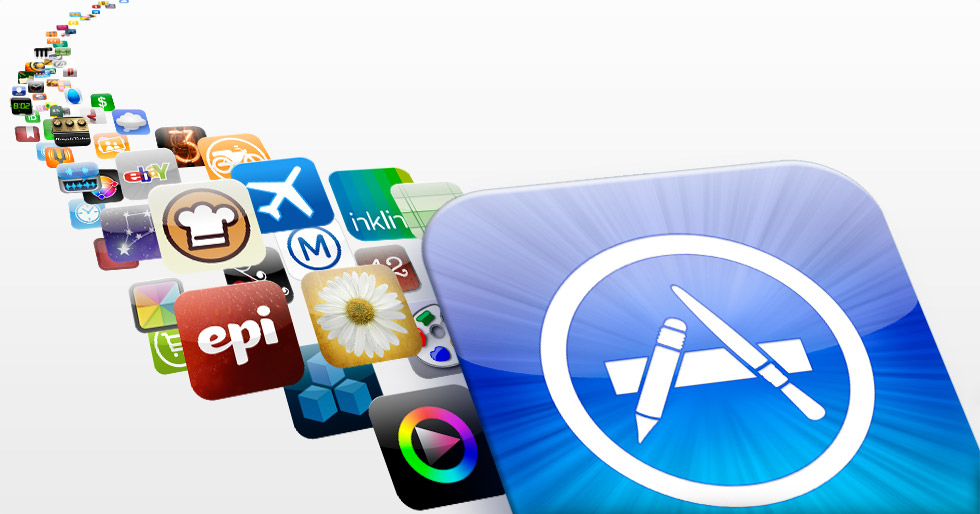
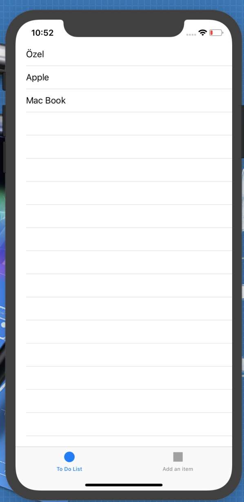
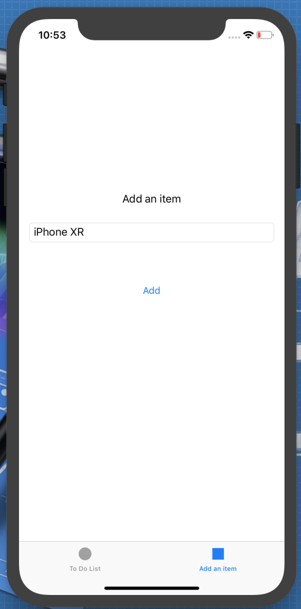
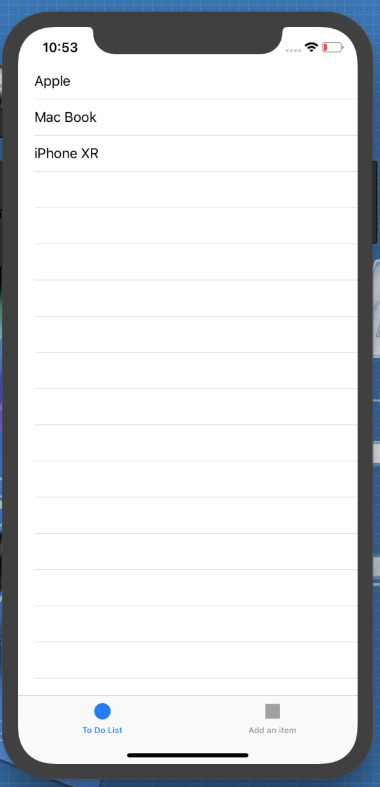

# iOS Projects (iOS Projeleri)

## Projenin Amacı

Swift-4.2 ile ilgili en temel konuları bir önceki projede anlatmaya devam ediyorum. Öğrendiklerimizi pekiştirmek ve birbirinden farklı projeler geliştirmek için oluşturulmuş bir projedir. Arkadaşlar her türlü eleştiri ve desteğe açığım :smile:

## Projenin İçeriği
Swift-4.2 ile geliştirilmiş olan birbirinden farklı seviyede uygulamaları içeren bir projedir.  

## Uygulamalar 

- [Images](https://github.com/halilozel1903/iOSProjects/tree/master/Images)
- [Segues](https://github.com/halilozel1903/iOSProjects/tree/master/Segues)
- [Timers](https://github.com/halilozel1903/iOSProjects/tree/master/Timers)
- [Gesture Recognizer](https://github.com/halilozel1903/iOSProjects/tree/master/GestureRecogziner)
- [Colors](https://github.com/halilozel1903/iOSProjects/tree/master/Colors)
- [Launch Screen](https://github.com/halilozel1903/iOSProjects/tree/master/LaunchScreen)
- [Alert](https://github.com/halilozel1903/iOSProjects/tree/master/AlertProject)
- [Table View](https://github.com/halilozel1903/iOSProjects/tree/master/TableViewExample)
- [Core Data](https://github.com/halilozel1903/iOSProjects/tree/master/CoreDataExample)
- [MapView](https://github.com/halilozel1903/iOSProjects/tree/master/MapView)
- [TouchID](https://github.com/halilozel1903/iOSProjects/tree/master/TouchID)
- [Tab Bars](https://github.com/halilozel1903/iOSProjects/tree/master/TabExample)
- [IntelligentImage](https://github.com/halilozel1903/iOSProjects/tree/master/IntelligentImage)
- [Navigation Bar](https://github.com/halilozel1903/iOSProjects/tree/master/NavigationBar)
- [Toolbar](https://github.com/halilozel1903/iOSProjects/tree/master/Toolbar)
- [Kronometre](https://github.com/halilozel1903/iOSProjects/tree/master/KronometreApp)
- [Klavyeyi Kontrol Etme](https://github.com/halilozel1903/iOSProjects/tree/master/KlavyeyiKontrolEtme)
- [ViewController](https://github.com/halilozel1903/iOSProjects/tree/master/ViewControllerApp)
- [Table View Example](https://github.com/halilozel1903/iOSProjects/tree/master/TableApp)
- [Table View Search](https://github.com/halilozel1903/iOSProjects/tree/master/TableViewSearch)
- [Collection View](https://github.com/halilozel1903/iOSProjects/tree/master/CollectionViewApp)
- [UIViewControllerLifecycle](https://github.com/halilozel1903/iOSProjects/tree/master/UIViewControllerLifecycle)
- [TabBarApp](https://github.com/halilozel1903/iOSProjects/tree/master/TabBarApp)
- [SwitchScreens](https://github.com/halilozel1903/iOSProjects/tree/master/SwitchScreens)
- [Delegate](https://github.com/halilozel1903/iOSProjects/tree/master/DelegateDataSaved)
- [NotificationCenter](https://github.com/halilozel1903/iOSProjects/tree/master/NotificationCenter)
- [FindMyAge](https://github.com/halilozel1903/iOSProjects/tree/master/FindMyAge)
- [Calculator](https://github.com/halilozel1903/iOSProjects/tree/master/Calculator)
- [Animations](https://github.com/halilozel1903/iOSProjects/tree/master/Animations)
- [SwipeAndShakeApp](https://github.com/halilozel1903/iOSProjects/tree/master/SwipeAndShakeApp)
- [SwipeGestureRecognizer](https://github.com/halilozel1903/iOSProjects/tree/master/SwipeGestureRecognizer)
- [Alert View](https://github.com/halilozel1903/iOSProjects/tree/master/AlertViewApp)
- [Picker View](https://github.com/halilozel1903/iOSProjects/tree/master/PickerViewApp)
- [Date Picker](https://github.com/halilozel1903/iOSProjects/tree/master/DatePickerViewApp)
- [Web View](https://github.com/halilozel1903/iOSProjects/tree/master/WebViewApp)
- [MVC App](https://github.com/halilozel1903/iOSProjects/tree/master/MVCApp)
- [MVVM App](https://github.com/halilozel1903/iOSProjects/tree/master/MVVMApp)
- [Cocoa Pods App](https://github.com/halilozel1903/iOSProjects/tree/master/CocoaPodsApp)
- [AudioSpeechRecognition](https://github.com/halilozel1903/iOSProjects/tree/master/AudioSpeechRecognition)
- [SpeechRecognition](https://github.com/halilozel1903/iOSProjects/tree/master/SpeechRecognition)
- [SpeechApp](https://github.com/halilozel1903/iOSProjects/tree/master/SpeechApp)
- [SiriKit](https://github.com/halilozel1903/iOSProjects/tree/master/MessageApp)
- [Quick Action](https://github.com/halilozel1903/iOSProjects/tree/master/QuickActionApp)
- [Custom Keyboard](https://github.com/halilozel1903/iOSProjects/tree/master/CustomKeyboardApp)
- [Prime Number App](https://github.com/halilozel1903/iOSProjects/tree/master/FindPrimeNumber)
- [Navigation Menu App](https://github.com/halilozel1903/iOSProjects/tree/master/NavigationMenuApp)
- [Bomb Timer App](https://github.com/halilozel1903/iOSProjects/tree/master/BombTimer)
- [Music App](https://github.com/halilozel1903/iOSProjects/tree/master/Xylophone-iOS11-master)
- [Language App](https://github.com/halilozel1903/iOSProjects/tree/master/LanguageApp)
- [Times Table App](https://github.com/halilozel1903/iOSProjects/tree/master/TimesTableApp)
- [UserDefaults App](https://github.com/halilozel1903/iOSProjects/tree/master/UserDefaultsApp)
- [Multiple View Controllers](https://github.com/halilozel1903/iOSProjects/tree/master/MultipleViewControllers)
- [ControllingTheKeyboard](https://github.com/halilozel1903/iOSProjects/tree/master/ControllingTheKeyboard)

 

## Uygulama İçerikleri

- [To Do List](https://github.com/halilozel1903/iOSProjects/tree/master/ToDoList) : To Do List uygulamasında TabView, TableView,Label,Text Field ve Button kullanılmıştır. Tab sayesinde sayfalar arası geçiş yapılabilmektedir. Kullanıcı 2.sayfada ekleme yapıp add butonuna tıklayınca UserDefaults içine kayıt edilip ilk ekranda onu TableView yardımıyla listelemektedir. Her eklenen veri için tablo güncellenmektedir. Listede istemediğimiz bir şey varsa sağdan sola hücreyi çekerek o bileşeni silebiliriz. Silinen elemanla birlikte table tekrardan güncellenir.

    
   

## Yararlandığım Kaynaklar

1. https://developer.apple.com/
2. https://www.udemy.com/ios-11-swift-4-baslangictan-ileri-seviyeye-mobil-uygulama
3. https://www.raywenderlich.com/category/ios
4. https://gelecegiyazanlar.turkcell.com.tr/konu/ios
5. https://www.udemy.com/swift-4-ile-baslangictan-ileri-seviyeye-mobil-uygulama-egitimi
6. https://www.udemy.com/ios-11-swift-4-ve-firebase-ile-uygulama-gelistirme
7. https://www.udemy.com/complete-ios-11-developer-course
8. https://www.udemy.com/ios-11-app-development-bootcamp/learn

# NOT
Örnek proje ve uygulamalar eklenmeye devam edecektir.  
